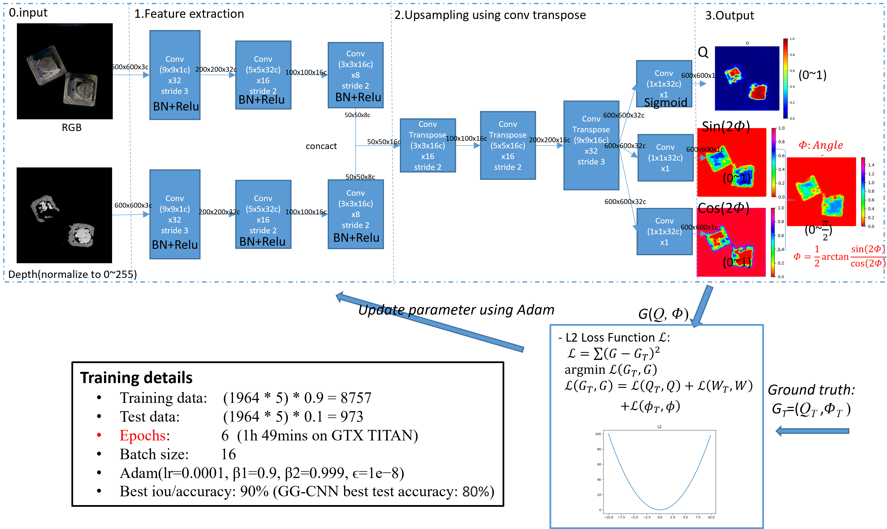
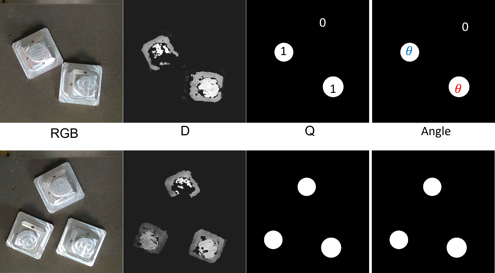

# Rgbd-GG-CNN
A simple Rgbd Generative Grasping CNN (Rgbd-GG-CNN)
# Here is the original paper: 
[Closing the Loop for Robotic Grasping: A Real-time, Generative Grasp Synthesis Approach](https://arxiv.org/abs/1804.05172)
[github](https://github.com/dougsm/ggcnn)
## Network Architecture

## Train
	train.py --dataset-path <Path>
## Test
	test.py --network epoch_04_iou_0.90 --dataset Oran --dataset-path <Path> --vis
## Dataset Example

