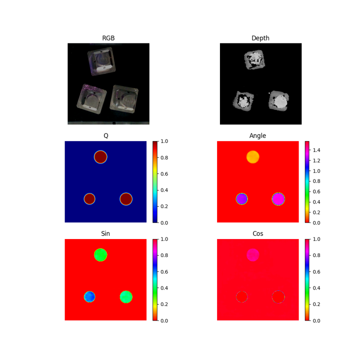

# Rgbd-GG-CNN
A simple Rgbd Generative Grasping CNN (Rgbd-GG-CNN)
# Here is the original paper: 
* [Closing the Loop for Robotic Grasping: A Real-time, Generative Grasp Synthesis Approach](https://arxiv.org/abs/1804.05172)
* [Github](https://github.com/dougsm/ggcnn)
---
## Network Architecture V1

## Network Architecture V2
improve：Use MobileNetV3 to extract Features

MobileNetV3(downsample 16 times),4 conv transpose layers(Upsample 16 times).
## Train
	train.py --dataset-path <Path>
## Test
	test.py --network epoch_04_iou_0.90 --dataset Oran --dataset-path <Path> --vis
## Test result

## Dataset Example

[Download Link](https://gsnckuedutw-my.sharepoint.com/:f:/g/personal/p76083029_gs_ncku_edu_tw/Eoa97q76hi1EqC1UkkFWE-cBGgFkZVHRsflegyYuCVKx9g?e=dUVym8)

